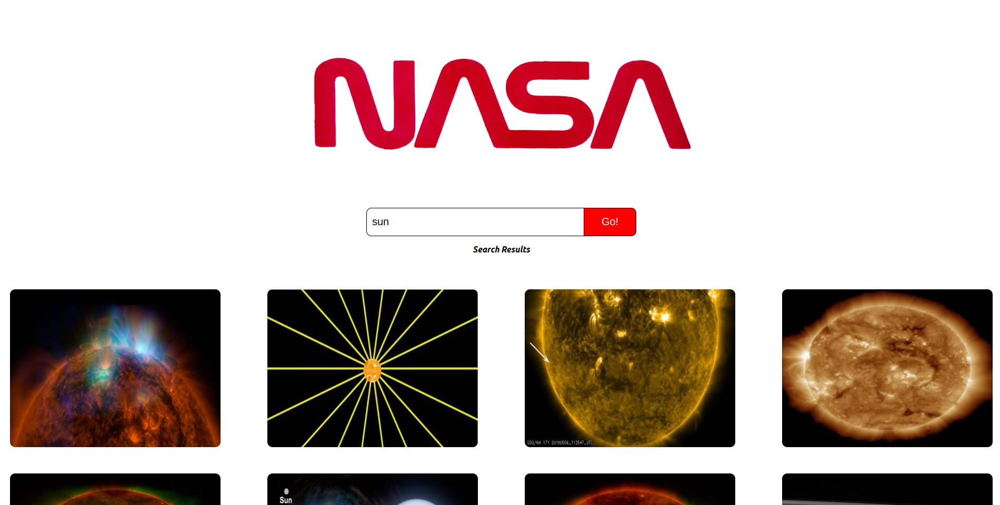
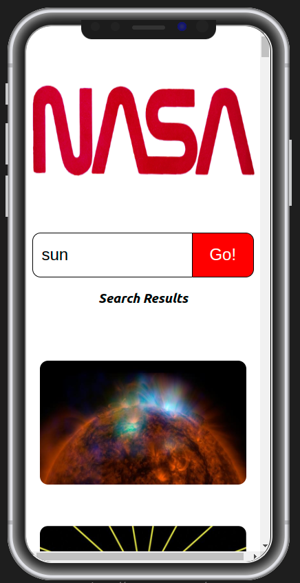

# Technical Test - React App

## Description

This repository contains the solution to the technical test, which involved building a React app. The main features and components of the app include searching space related pictures.

## Screenshots

### Desktop View

### Mobile View

## Technologies Used

- **React**: The app is built using the React library.
- **Testing Utilities**: Jest and React Testing Library were employed for testing purposes.
- **Packages Used**: Axios for making HTTP requests, and PropTypes for type checking.

## How to Run the App

1. Clone the repository to your local machine.
2. Navigate to the project directory using the command line.
3. Run `npm install` to install dependencies.
4. Execute `npm start` to launch the app in your browser.

## What I Would Do If I Had More Time

While the current version of the app fulfills the basic requirements, here are some improvements that could be made if more time were available:

- Enhance responsiveness for different types of mobile devices.
- Implement CSS animations to enhance the visual appeal.
- Make the images in search results clickable to be able to see pictures without distortion.

## Author

**Tuğcan Özaktaş**

---